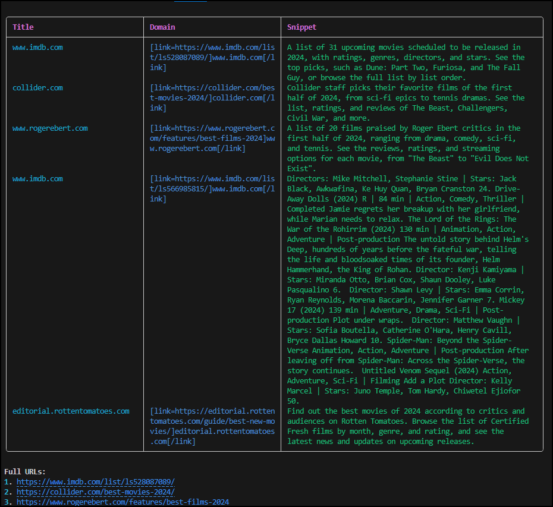

# Ollama Tools Ai


## Overview

Ollama Tools AI is a work-in-progress project focused on implementing advanced AI functionalities, including function calling and tool usage. This project aims to provide a robust and flexible framework for AI-driven tasks and interactions.

## Features

- **Function Calling**: Seamlessly integrate and call various functions to perform tasks.
- **Tool Usage**: Utilize different tools for enhanced AI capabilities.
- **Asynchronous Operations**: Efficient handling of asynchronous tasks and operations.


```env
# API Keys
# ANTHROPIC_API_KEY=
# OPENAI_API_KEY=
TAVILY_API_KEY=tvly-

# WEATHER_API_KEY=
# NEWS_API_KEY=


# Models-  llama3-groq-tool-use , llama3.1 , llama3 , mistral
OLLAMA_MODEL=llama3.1
# CLAUDE_MODEL=claude-3-5-sonnet-20240620

# Search  SEARXNG or TAVILY
SEARCH_PROVIDER=TAVILY
SEARCH_RESULTS_LIMIT=5

# Urls
OLLAMA_URL=http://127.0.0.1:11434
SEARXNG_URL=http://192.168.1.20:4000

```
Install dependencies 

`pip install -r requirements.txt`


## Usage

```bash
python ol.py
```


## More soon...

