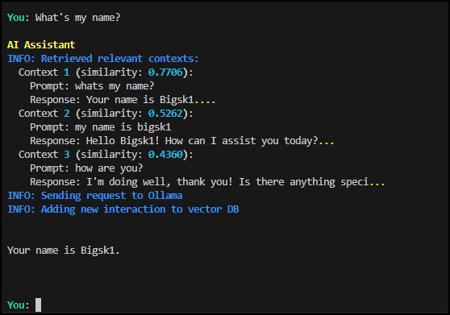
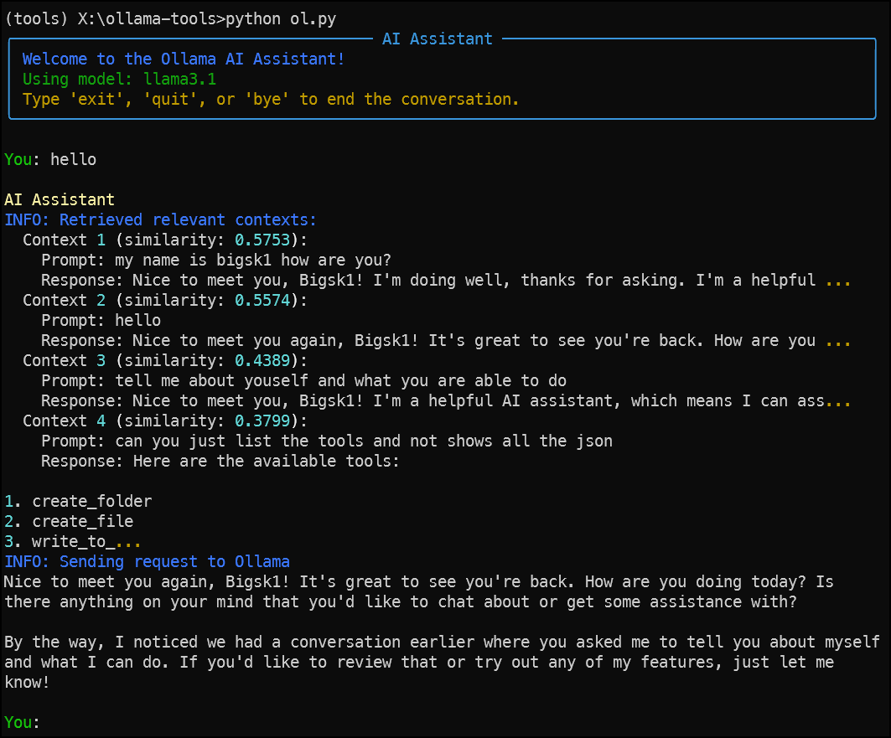

# Ollama Tools Ai


## Overview

Ollama Tools AI is a work-in-progress project focused on implementing advanced AI functionalities, including function calling and tool usage. This project aims to provide a robust and flexible framework for AI-driven tasks and interactions.

## Features

- **Function Calling**: Seamlessly integrate and call various functions to perform tasks.
- **Tool Usage**: Utilize different tools for enhanced AI capabilities.
- **Web Search**: Use searXNG or Tavily for web searches
- **Create**: The AI will create folders and files, read files, list files, delete files, web search and more..
- **DB Similarity**: Every chat and tool use is saved in DB for future context aware AI responses.


```env
# API Keys
TAVILY_API_KEY=tvly-

# Models
OLLAMA_MODEL=llama3-groq-tool-use
EMBED_MODEL=nomic-embed-text

# Search Configuration
SEARCH_PROVIDER=SEARXNG
SEARCH_RESULTS_LIMIT=5

# URLs
OLLAMA_URL=http://127.0.0.1:11434
SEARXNG_URL=http://192.168.70.48:4000

# Database Configuration
DB_DIR=./chromadb  # database location realitive to current directory
N_CONTEXTS=3   # Number of contexts to retrieve from DB - you can adjust this for testing
SIMILARITY_THRESHOLD=0.7  # Adjust this value to control context relevance (lower is more strict)

# Debug print statements in terminal False or True
DEBUG_MODE=False

```
Install dependencies 

`pip install -r requirements.txt`


## Usage

```bash
python ol.py
```







## Examples

Use multiple tools at once

```bash
<tool_call>
{"name": "search", "arguments": {"query": "latest ollama tools"}}
</tool_call>

<tool_call>
{"name": "create_file", "arguments": {"path": "./web_search.txt"}}
</tool_call>

<tool_call>
{"name": "write_to_file", "arguments": {"path": "./web_search.txt", "content": "[Insert Search
Data Here]"}}
</tool_call>INFO: Tool executed successfully.
```